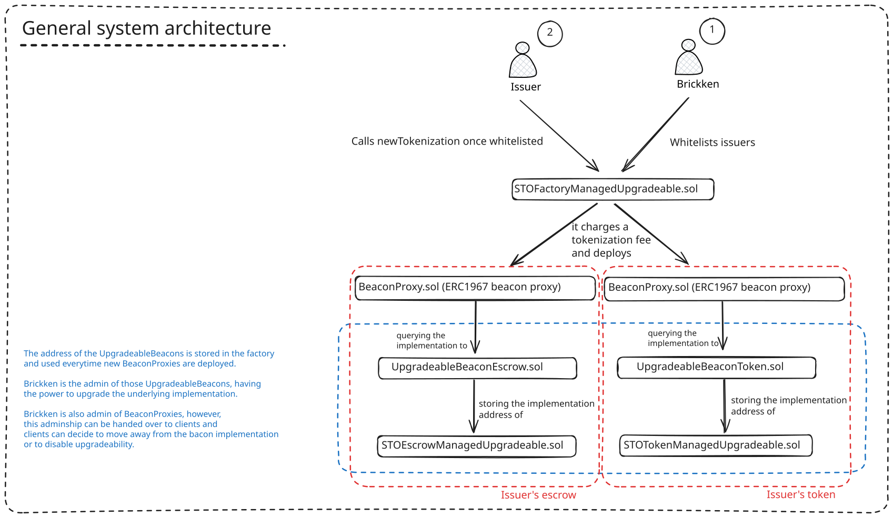
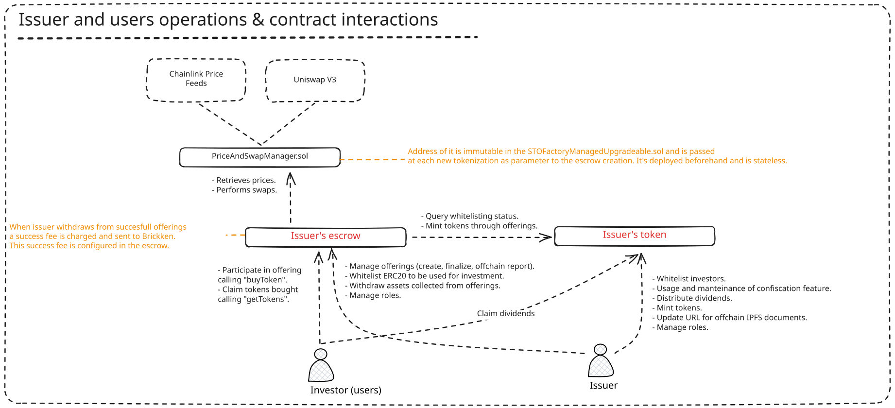
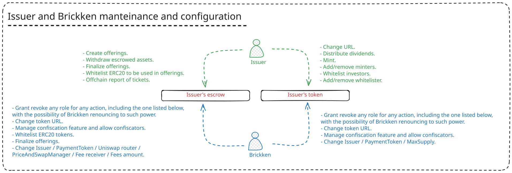
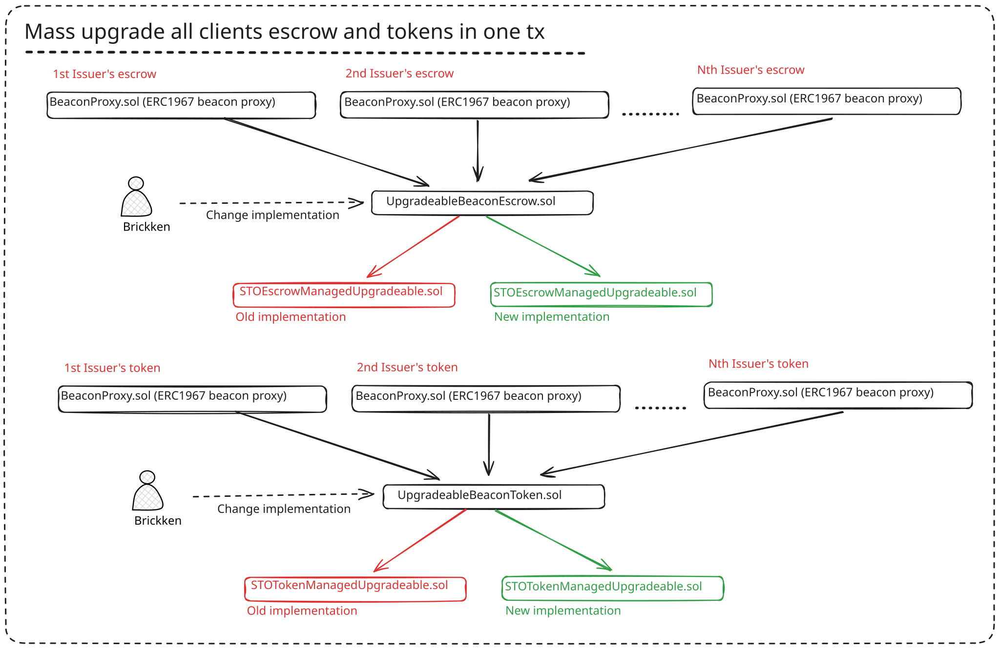
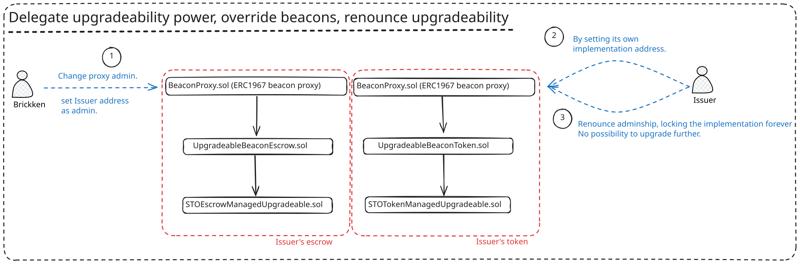

# Brickken protocol

This document aims to describe all the parts behind the Brickken protocol from a functional and technical perspective. Brickken provides a system to tokenize digital assets, binding compliance and legality through a semi-permissioned set of smart contracts that aims to handle the logic for token generation, offerings management and the entire life cycle of either a security token, a debt token, or an equity token.

Brickken is a technological provider, having a general purpose protocol that can be easily adapted to any circumstance. Due to the immature market, Brickken contracts are all upgradeable and roles and priviliges are described in each corresponding section. However, Brickken strongly believes in immutability and permissionless management, so in future versions, ugpradeability will be removed. The technical specifications of the upgradeability mechanism are described at the end of this document.

All use cases follow a similar structure where there's a `factory` contract that is responsible for emitting a new `token` and `escrow` contract for each issuer. Issuers are Brickken's clients and are the ones willing to tokenize their assets, their equities or their debts.

After a process of due diligence to comply with regulations, Brickken will whitelist individual issuers to operate through the factory. Once an issuer is whitelisted, they can go to the factory of the corresponding use case and effectively tokenize their asset/equity/debt. The whitelisting process aims to explcitly log into the blockchain the process of due diligence done for Brickken, for easy auditability and accountability of responsibility.

After a succesfull interaction with the `factory`, the issue will effectively deploy its own `token` and `escrow`.

- The `token` is the digital representation of what is being tokenized.
- The `escrow` is the contract that handles the logic to create offerings of the `token`, escrowing investors funds.

Investors are not Brickken clients and are users that interact directly with the issuer `escrow` willing to buy their `token`s.

Brickken charges a tokenization fee denominated in `BKN` tokens at the time of interacting with the `factory` and a `success fee` everytime an offering has reached its softcap and a partial withdraw or finalize issuance are executed by the issuer.
- The mentioned success fee  is governed by this formula:
```math

\begin{align*}
&F_{toPay} = 
R_A·\frac{A_w}{P_T - P_w}
·F_{ee}\bigg(1-\frac{F_a}{F_T}\bigg) \
\hline \
&R_A: \text{Total Raised Amount }\
&A_w: \text{Amount To Withdraw }\
&P_T: \text{Total Payment Tokens Collected }\
&P_w: \text{Issuance Partial Withdrawns}\
&F_{ee}: \text{Issuance Success Fee }\
&F_a: \text{Accumulated fee paid} \
&F_T: \text{Total Fee to be paid in the issuance}  
\end{align*}
```
Here a diagram of the general architecture of the system:



These are general features that apply to all use cases. Now let's analyze every single use case in their specific features.

## Security and equity tokenizations

The corresponding contracts to the `factory`, `escrow` and `token` instances discussed for this use case are:

```
factory: STOFactoryManagedUpgradeable.sol
escrow: STOEscrowManagedUpgradeable.sol
token: STOTokenManagedUpgradeable.sol
```

Here the objective is that an issuer wants to receive assets from investors in exchange for their `token`. For this reason the issuer will run one or several offerings of the `token` so that investors can participate in it. 

Again, to offload legal responsibilities and comply with local regulations, investors must be whitelisted by the issuer before being able to participate in any offering. The whitelist status is at `token` level and doesn't depend on the `escrow`. The purpose is to give the possibility to the issuer to review the KYC of their investors and comply with the law. Non whitelisted users can still receive the `token`s but they will not be able to transfer them out until they get whitelisted by the issuer. By this means Brickken is a technological provider that allows for any offchain law compliance by the use of whitelists.

Offerings details include a price in USD, a min and a max ticket, a soft and a hard cap, and specific deadlines When interacting with the `factory` in order to create an `escrow` and a `token`, the issuer will also specify a `paymentToken`; this is the asset that the issuer wants to receive when withdrawing investors money.

During the course of an offering, investors can always invest using the `paymentToken` defined. However, the `escrow` provides additional functionality so that the `issuer` can whitelist specific `ERC20` assets so that:

- Investors will invest with any of the whitelisted assets
- Assets which are not `paymentToken` will be automatically swapped through a Uniswap v3 integration for the `paymentToken`. 

Slippage protection are in the `escrow` logic. The only requirement before whitelisting an asset `X` is that it must exist a pool `X/paymentToken` with sufficient liquidity on Uniswap v3.

Usually, the `paymentToken` is a stable asset so that value is preserved during the course of offerings and no value is lost because of volatility. However, in order to protect also from stables depegs and also allow for non stable assets, each `paymentToken` comes with an oracle that gives the price of it in terms of USD. This oracle is then used in the `escrow` logic so that correct USD value is always accounted. The oracle is a standard `Chainlink` price feed. Additional safety checks on price retrieval are added so that price is checked to be non stalled.

The specific use case of equity tokenizations, the only difference is that `paymentToken` is actually an already existing `equity` token. This means that it might not have a specific price to be used, and the only intention of the issuer is to collect equity tokens without their actual value. For this, in this specific case, the oracle associated with the `paymentToken` must be the address zero. In this last case, the logic is prepared to handle this specific case and no further changes are required.

An offering is considered succesfull everytime its soft cap is reached and the end date is reached. If the hard cap is reached before the end date, it is also considered succesfull. Any other case implies a failing offering.

Offerings run in sequence, so that at any time there can be only one offering occurring. If an offering is succesfull before the end date (soft cap reached) the issuer can start withdraw the money collected before the end date. Once the end date or the hardcap is reached, the issuer must finalize the offering in order to create a new one.

The same applies to investors, if an issuance is succesfull before the end date, they can start claiming their `token`s. If an issuance is not succesfull they can get refunded. The only limitation is that if they invested with an asset `X` different from `paymentToken`, their refund will be denominated in `paymentToken`. This is because `X` is automatically swapped to `paymentToken` once the user invested.

One additional feature is that the issuer might receive investments outside of the onchain operations but still want to account for them in the current onchain offering. For this an offchain reporting mechanism is being added where the issuer can specify how much has been bought and to which wallet such ticket shoould be assigned.

The `token` being sold to investors is a standard `ERC20` compliance token with some added features:
- As mentioned it features a whitelist so that investors are KYCed correctly
- It offers confiscation feature: the issuer can revoke tokens from investors. This is to protect against frauds where tokens are sent to users that are not legally compliant with regulations. This feature can be paused or freezed.
- If offers dividend distribution. At any moment the issuer can distribute dividends obtained from the underlying asset revenue. For this, the token tracks historical users balance to correctly account at any moment for the correct percentage owed to each token holder.
- Similarly to ERC721, the token has an URI that can be queried at any time. This URI will point to an offchain IPFS document that will contain:
    - Any legal document to support the underlying asset being tokenized
    - Any offchain reporting report to prove the authenticity of an offchain ticket being bought

Thanks to the track of historical balance, future versions of the token will offer the possibility of using it to vote and being used as a voting token.

Here a summary of the operations and contracts interactions:



### Roles and trust assumptions

During the interaction with the `factory` the issuer will pass some inputs parameters like the `paymentToken` or the Uniswap v3 router to be used. This is easily done through our dashboard where the issuer doesn't have to worry about collecting the right information, but the final trust assumption is that investors will have to do their own due diligence before investing in an offering. Specifically, a part from Brickken's due diligence on checking validity and good intention of the issuer, the investors can check the details of the configuration and of the parameters used if they want to be sure of the legitimacy of any escrow and token. Moreover, the dashboard provides a way to investors to easily query the documents provided at the `token` URI and evaluate their authenticity.

Having said that, the roles in the system are as follow having their default actors written between parenthesis. Notice that Brickken has some privileged roles within the issuer contracts. This is because many of the clients are non tech-savy and decide to rely on Brickken to perform some specific actions, however, do notice that this can be renounced by Brickken and 100% of the priviliges can be given out to the issuer at any moment.

On each new `escrow`:

    - DEFAULT_ADMIN_ROLE = grant/revoke ANY role (brickken);
    - ESCROW_WITHDRAW_ROLE = who can withdraw / partially withdraw to issuer the escrowed money (issuer);
    - ESCROW_NEW_OFFERING_ROLE = starts a new offering (issuer);
    - ESCROW_OFFERING_FINALIZER_ROLE = finalize an offering (brickken, issuer);
    - ESCROW_ERC20WHITELIST_ROLE = add/remove ERC20 from whitelist (brickken, issuer);
    - ESCROW_OFFCHAIN_REPORTER_ROLE = report offchain USD tickets for current offering (issuer)

The `DEFAULT_ADMIN_ROLE` can also change configuration on the `escrow` contract in case an emergency config change is needed like:
    - Change the issuer address to a new one in case the old issuer address is compromised.
    - Change the configured `paymentToken`.
    - Change the Uniswap v3 router address.
    - Change the configured `PriceAndSwapManager` address.
    - Change the amount of success fees or `withdrawalFee`.
    - Change the treasury address (the address that will receive the withdrawal fees).

On each new `token`:

    - DEFAULT_ADMIN_ROLE = grant/revoke ANY role (brickken)
    - TOKEN_URL_ROLE = change url (brickken,issuer);
    - TOKEN_DIVIDEND_DISTRIBUTOR_ROLE = distribute dividends (issuer);
    - TOKEN_MINTER_ROLE = mint new tokens (issuer, escrow contract related to this token);
    - TOKEN_MINTER_ADMIN_ROLE = add/remove minters (issuer);
    - TOKEN_WHITELIST_ADMIN_ROLE = change investors whitelist (issuer);
    - TOKEN_WHITELIST_ROLE = whether the user is whitelisted or not (issuer);
    - TOKEN_CONFISCATE_EXECUTOR_ROLE = execute confiscation (brickken);
    - TOKEN_CONFISCATE_ADMIN_ROLE = pause / unpause or disable confiscation (brickken);

The `DEFAULT_ADMIN_ROLE` can also change configuration on the `token` contract in case an emergency config change is needed like:
    - Change the issuer address to a new one in case the old issuer address is compromised.
    - Change the configured `paymentToken`.
    - Change the `maxSupply` of the token.

The reason of why such many roles exist is to modularize actions so that the issuer can delegate some specific operations to other actors but also to avoid using the same wallet for everything so that more sensitive actions can be mantained on cold wallets, while less sensitive actions can be given to hot wallets.

Here a summary of the manteinance and configuration of the protocol with their corresponding roles:



## Debt tokenizations

[WIP] - This will be implemented in future release and its part of 2024 Roadmap.

## Upgradeability architecture

The entire upgradeability system is achieved through [OpenZeppelin contracts library](https://docs.openzeppelin.com/contracts/4.x/). There are two upgradeability mechanisms in place:

### Factory upgradeability

Since the `factory` is a contract owned by Brickken and not by Brickken's clients it is completely managed by us. It uses the [UUPS upgradeability pattern](https://docs.openzeppelin.com/contracts/4.x/api/proxy#UUPSUpgradeable), having the upgrade logic residing in the implementation itself. The proxy is a standard ERC1967Proxy. The account responsible for upgrading the `factory` implementation is one of the Brickken's Safe Multisigs.

### Escrow and Token upgradeability

The `escrow` and `token` contracts are not following UUPS upgradeability pattern but instead they use a modified version of [beacons proxies](https://docs.openzeppelin.com/contracts/4.x/api/proxy#beacon). Beacons are a way to mass upgrade several proxies with just one transaction. This works by not having the implementation address being stored in the proxy but instead relying on an external beacon contract. Through the beacon contract, any change to the implementation address would be automatically reflected to all of the proxies using that beacon and relying on it.

For this reasons, whenever a Brickken's client tokenize through the factory, what the factory actually does it to span two new proxies (one for `escrow` and one for `token`) that use external beacons to query the correct implementation address.

The proxies spawned by the factory are instances of `BeaconProxy.sol` while the beacons providing the addresses of the `escrow` and `token` implementation are the `UpgradeableBEaconEscrow.sol` and `UpgradeableBeaconToken.sol` correspondigly.

The reason of why beacons pattern is being used is because of the following reasons:

- We believe many clients don't want to handle manteinance of their `escrow` and `token`.
- We belive the protocol will still evolve significantly so that we want to give the possibility to early clients to stay up-to-date with latest features and bugs corrections without haveing to renounce to their already created tokens.
- It's easier and more efficient when it comes to upgrade several tokens or escrows to a new version.

However, as mentioned at the beginning, we still believe in self-determination and operation so that upgradeability and use of beacons can be handed over to clients and even freezed forever. This mechanism works as follow:

- The `admin` in charge of upgrading a proxy is initially Brickken's multisig. Brickken will call the `changeProxyAdmin` function into the `BeaconProxy.sol` contract and give adminship to self-empowered client.
- Once the client is the admin of their own proxies, they can either:
    - Upgrade to the implementation of their choice by calling `changeImplementationOverrideBeacon` function. In this way a new implementation address will be stored. If this value is set to a non null value, whenever the proxy will query the implementation address by the use of internal `_implementation` function, the recently set value will be used and the beacon's implementation address will be ignored. This is effectively an override of the beacons patterns so that it will be ignored. Notice that this can be rolled back at any moment by calling the same `changeImplementationOverrideBeacon` setting a null value again and defaulting to the beacons pattern again.
    - Disable the upgradeability mechanism forever by locking-in the address passed in the `renounceUpgradeability(address finalImplementation)` function as final implementation address. Notice that this will set the admin to the `0xdead` address, permanently freezing the upgradeability mechanism from being used further. Be aware that there's no rollback from this.
 
Here a summary of how upgrades are performed:



While here a diagram of how upgradeability can be handed over to the issuer or being freezed:



